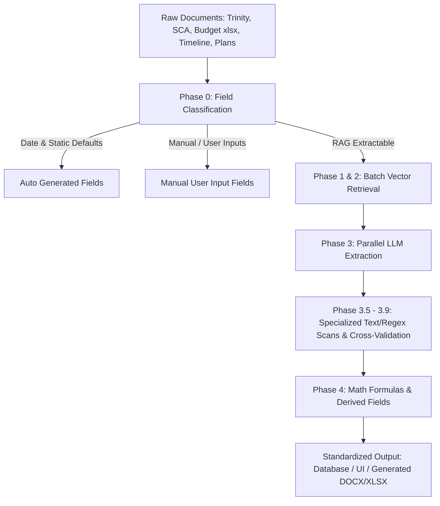

# Feasibility Review Template — Comprehensive 39 Fields Reference

This document provides a complete technical and functional breakdown of all **39 fields** in the Genesis Capital Feasibility Review system. It explains the purpose of each field, where it belongs in the report, its data type and options, and the exact step-by-step logic used by the system to extract, evaluate, calculate, and populate each value.

---

## Architecture & Extraction Pipeline Overview

The feasibility extraction engine uses a hybrid multi-phase architecture combining:
1. **RAG Vector Search (Qdrant & Embeddings)**: Querying chunked document vectors.
2. **Targeted LLM Extraction**: LLM prompts with strict field-specific hints and constraints.
3. **Deterministic Regular Expression / Structured Document Scanners**: High-accuracy scanners for structured spreadsheets (`.xlsx`) and tables.
4. **Multi-Source Cross-Validation & Sanity Gates**: Business rules (e.g. `Holdback ≤ Rehab`, `Structures ≤ Units`, gate-checking against feasibility documents).
5. **Calculated Formulas**: Automated mathematical derivations for cost-per-metrics and timelines.
6. **Frontend Dynamic Recalculation**: Live updates in the user interface when dependent numbers change.

---

## 1. Report Header (6 Fields)

### 1.1 `Date of Report Approved`
* **Section:** `Report Header` (`header`)
* **Field Type:** `date`
* **Source:** Date of report generation
* **Description:** The date on which the feasibility review is generated or approved.
* **Extraction & Evaluation Logic:**
  * **Auto-generated (Phase 0):** Evaluated deterministically in `extract_all_fields()` without calling LLM or vector search.
  * **Value:** Populated with today's date in canonical ISO format (`YYYY-MM-DD`) via `date.today().isoformat()`.
  * **Rendering:** Populates `<input type="date">` in the UI; formatted as `MM/DD/YYYY` in previews and generated reports.
* **Code Reference:** [`backend/retrieval/field_definitions.py:14-19`](file:///c:/Users/Lanovo/Downloads/genesis_feasibility-alignment-issues-cdk/backend/retrieval/field_definitions.py#L14-L19), [`backend/retrieval/extract_fields.py:630-635`](file:///c:/Users/Lanovo/Downloads/genesis_feasibility-alignment-issues-cdk/backend/retrieval/extract_fields.py#L630-L635)

---

### 1.2 `Project Address / Title`
* **Section:** `Report Header` (`header`)
* **Field Type:** `freeform`
* **Source:** Trinity Report - Cover page *(Fallbacks: Construction Budget, SCA)*
* **Description:** The full physical street address (street, city, state, zip) and optional project development name (e.g. *Belle Oaks at Richmond Building 7*).
* **Extraction & Evaluation Logic:**
  * **RAG Retrieval:** Vector search matches property address, project title, and subject property chunks across Trinity, Budget, and SCA documents.
  * **LLM Extraction:** Prompted with `FIELD_EXTRACTION_HINTS["Project Address / Title"]`, which instructs the model to:
    1. Strip deal/loan IDs (e.g., `G25069850` or `25090922 - `).
    2. Prevent repeating duplicate street names.
    3. Prepend any project name before the address.
  * **Phase 3.5 Text Scan Fallback:** `_extract_address_from_text()` scans the full Trinity report for address patterns. If LLM is empty or returned a partial address lacking city/state, the fuller regex match is used.
  * **Phase 3.8 Normalization:** Cleaned through `_clean_project_address()` to remove residual trailing punctuation or deal ID artifacts.
* **Code Reference:** [`backend/retrieval/field_definitions.py:21-27`](file:///c:/Users/Lanovo/Downloads/genesis_feasibility-alignment-issues-cdk/backend/retrieval/field_definitions.py#L21-L27), [`backend/retrieval/extract_fields.py:269-284, 1260-1281, 1640-1643`](file:///c:/Users/Lanovo/Downloads/genesis_feasibility-alignment-issues-cdk/backend/retrieval/extract_fields.py#L269-L284)

---

### 1.3 `Sponsor`
* **Section:** `Report Header` (`header`)
* **Field Type:** `freeform`
* **Source:** Glass - Sponsors / SCA *(Expected Document: `SCA`)*
* **Description:** The full development company or legal entity sponsoring the project (e.g., *DealPoint Merrill LLC*, *Agador Spartacus Development fka MAS Development*).
* **Extraction & Evaluation Logic:**
  * **Document Filtering:** Document boost prioritizes Sponsor Construction Analysis (`SCA`) chunks.
  * **LLM Extraction:** Guided by `FIELD_EXTRACTION_HINTS["Sponsor"]`. Extracts the development entity including any `fka` (formerly known as), `dba` (doing business as), or `aka` designators. Explicitly forbids returning an individual person's name.
* **Code Reference:** [`backend/retrieval/field_definitions.py:29-35`](file:///c:/Users/Lanovo/Downloads/genesis_feasibility-alignment-issues-cdk/backend/retrieval/field_definitions.py#L29-L35), [`backend/retrieval/extract_fields.py:115-120`](file:///c:/Users/Lanovo/Downloads/genesis_feasibility-alignment-issues-cdk/backend/retrieval/extract_fields.py#L115-L120)

---

### 1.4 `Borrower Entity`
* **Section:** `Report Header` (`header`)
* **Field Type:** `freeform`
* **Source:** Glass - Loan *(Fallbacks: Construction Budget, Trinity, SCA)*
* **Description:** The borrowing legal entity / LLC name executing the loan agreement.
* **Extraction & Evaluation Logic:**
  * **RAG Retrieval:** Vector queries search for header patterns (`CLIENT:`, `Sponsor Name:`, `Borrower:`, `Entity:`) in the first 5 rows of budget spreadsheets and loan summary sheets.
  * **LLM Extraction:** Extracts the legal borrowing entity name; drops timestamps, dates, or individual names.
* **Code Reference:** [`backend/retrieval/field_definitions.py:37-43`](file:///c:/Users/Lanovo/Downloads/genesis_feasibility-alignment-issues-cdk/backend/retrieval/field_definitions.py#L37-L43), [`backend/retrieval/extract_fields.py:121-127`](file:///c:/Users/Lanovo/Downloads/genesis_feasibility-alignment-issues-cdk/backend/retrieval/extract_fields.py#L121-L127)

---

### 1.5 `Project Status`
* **Section:** `Report Header` (`header`)
* **Field Type:** `dropdown`
* **Source:** User input
* **Predefined Options:**
  1. `Approved`
  2. `Approved with Conditions`
  3. `Not Approved due to Budget Concerns`
* **Description:** The final underwriting feasibility approval status decided by the Genesis construction team.
* **Extraction & Evaluation Logic:**
  * **Manual User Input:** Bypasses automated RAG extraction during Phase 0 (`source="requires_user_input"`, `method="manual"`).
  * Selected manually by the loan analyst via dropdown in the UI.
* **Code Reference:** [`backend/retrieval/field_definitions.py:45-54`](file:///c:/Users/Lanovo/Downloads/genesis_feasibility-alignment-issues-cdk/backend/retrieval/field_definitions.py#L45-L54), [`backend/retrieval/extract_fields.py:656-661`](file:///c:/Users/Lanovo/Downloads/genesis_feasibility-alignment-issues-cdk/backend/retrieval/extract_fields.py#L656-L661)

---

### 1.6 `Report Created by:`
* **Section:** `Report Header` (`header`)
* **Field Type:** `dropdown`
* **Source:** User input
* **Predefined Options:**
  * `Cynthia Moreno`
  * `Amin Mojarad`
  * `Noah Vargas`
  * `Marques Walker`
  * `Donovan Bowes`
  * `Gina Siu`
  * `Katrine Audish`
* **Description:** The Genesis Capital construction team member / analyst who prepared the report.
* **Extraction & Evaluation Logic:**
  * **Manual User Input:** Bypasses automated RAG extraction during Phase 0 (`source="requires_user_input"`, `method="manual"`).
  * Selected in the UI and transmitted as metadata (`generated_by`) to report generation endpoints.
* **Code Reference:** [`backend/retrieval/field_definitions.py:56-69`](file:///c:/Users/Lanovo/Downloads/genesis_feasibility-alignment-issues-cdk/backend/retrieval/field_definitions.py#L56-L69), [`backend/retrieval/extract_fields.py:656-661`](file:///c:/Users/Lanovo/Downloads/genesis_feasibility-alignment-issues-cdk/backend/retrieval/extract_fields.py#L656-L661)

---

## 2. Executive Summary (12 Fields)

### 2.1 `Additional Comments:`
* **Section:** `Executive Summary` (`executive_summary`)
* **Field Type:** `narrative`
* **Source:** SCA (Sponsor Construction Analysis) *(Expected Document: `SCA`)*
* **Description:** A 2–3 paragraph executive narrative detailing the Sponsor's track record, experience, construction approval tier, and team evaluation, followed by a dynamic project summary line.
* **Extraction & Evaluation Logic:**
  * **RAG Retrieval:** Pulls up to 12 context chunks prioritized from the SCA document.
  * **LLM Synthesis:** Prompted with strict zero-hallucination instructions (`NARRATIVE_FIELD_INSTRUCTIONS["Additional Comments:"]`). Only includes verbatim/traceable facts regarding sponsor overview, construction approval, and financial profile. Prohibits markdown headers, bullets, or loan metrics (e.g. LTV, LTC, DSCR).
  * **Post-Processing (Phase 4):** A deterministic summary sentence is appended at the end:
    > *"This report is for the [Project Type] of a [No. of Stories] [Property Type] with [No. of Units] Units totaling approximately [GFA] gross square feet."*
* **Code Reference:** [`backend/retrieval/field_definitions.py:72-78`](file:///c:/Users/Lanovo/Downloads/genesis_feasibility-alignment-issues-cdk/backend/retrieval/field_definitions.py#L72-L78), [`backend/retrieval/extract_fields.py:336-353, 2050-2077`](file:///c:/Users/Lanovo/Downloads/genesis_feasibility-alignment-issues-cdk/backend/retrieval/extract_fields.py#L336-L353)

---

### 2.2 `Third-Party Review`
* **Section:** `Executive Summary` (`executive_summary`)
* **Field Type:** `dropdown`
* **Source:** Trinity Report *(Expected Document: `Trinity`)*
* **Predefined Options:**
  1. `None`
  2. `feasibility`
  3. `budget review`
* **Description:** The scope type of the third-party engineering/construction report.
* **Extraction & Evaluation Logic:**
  * **LLM Extraction:** Searches Trinity report context. If plans, budget, and scope were reviewed together, selects `feasibility`. If only budget was reviewed without drawings/plans, selects `budget review`.
  * **Dropdown Validation:** `_validate_dropdown()` normalizes output against the exact option list.
* **Code Reference:** [`backend/retrieval/field_definitions.py:80-86`](file:///c:/Users/Lanovo/Downloads/genesis_feasibility-alignment-issues-cdk/backend/retrieval/field_definitions.py#L80-L86), [`backend/retrieval/extract_fields.py:165-170, 821-829`](file:///c:/Users/Lanovo/Downloads/genesis_feasibility-alignment-issues-cdk/backend/retrieval/extract_fields.py#L165-L170)

---

### 2.3 `Third-Party Reviewer`
* **Section:** `Executive Summary` (`executive_summary`)
* **Field Type:** `dropdown`
* **Source:** Trinity Report *(Expected Document: `Trinity`)*
* **Predefined Options:**
  * `Trinity`
  * `Granite`
  * `DCMI`
  * `Northwest Monitoring`
* **Description:** The third-party inspection company that authored the feasibility report.
* **Extraction & Evaluation Logic:**
  * **LLM Extraction:** Scans header/cover chunks for vendor keywords (*Trinity Inspection Services*, *Granite*, *DCMI*, *Northwest Monitoring*).
  * **Dropdown Validation:** Matches the identified reviewer to one of the 4 approved firms.
* **Code Reference:** [`backend/retrieval/field_definitions.py:88-94`](file:///c:/Users/Lanovo/Downloads/genesis_feasibility-alignment-issues-cdk/backend/retrieval/field_definitions.py#L88-L94), [`backend/retrieval/extract_fields.py:265-268, 821-829`](file:///c:/Users/Lanovo/Downloads/genesis_feasibility-alignment-issues-cdk/backend/retrieval/extract_fields.py#L265-L268)

---

### 2.4 `Third-party Review (Good/Bad)`
* **Section:** `Executive Summary` (`executive_summary`)
* **Field Type:** `dropdown`
* **Source:** Trinity Report - pg.1 *(Expected Document: `Trinity`)*
* **Predefined Options:**
  1. `appropriate`
  2. `not appropriate`
* **Description:** Rating of whether the overall project cost and risk level are appropriate for the proposed scope.
* **Extraction & Evaluation Logic:**
  * **LLM Extraction:** Reads Page 1 / executive summary of the third-party report. Evaluates phrases such as *"cost is reasonable and appropriate for the proposed scope"* vs *"not appropriate"*.
  * **Dropdown Validation:** Validates and outputs `appropriate` or `not appropriate`.
* **Code Reference:** [`backend/retrieval/field_definitions.py:96-102`](file:///c:/Users/Lanovo/Downloads/genesis_feasibility-alignment-issues-cdk/backend/retrieval/field_definitions.py#L96-L102), [`backend/retrieval/extract_fields.py:442-446, 821-829`](file:///c:/Users/Lanovo/Downloads/genesis_feasibility-alignment-issues-cdk/backend/retrieval/extract_fields.py#L442-L446)

---

### 2.5 `Third-Party Review (Meet or Fail)`
* **Section:** `Executive Summary` (`executive_summary`)
* **Field Type:** `dropdown`
* **Source:** Trinity Report *(Expected Document: `Trinity`)*
* **Predefined Options:**
  1. `meets best practice and is Recommended for Approval`
  2. `meets best practice with Advisement or Conditions Recommended for Approval`
  3. `does not meet best practice and should Not be Approved`
* **Description:** The third-party reviewer's formal recommendation and best practice evaluation.
* **Extraction & Evaluation Logic:**
  * **LLM Extraction:** Inspects conclusion sections for approval recommendations and advisements/conditions.
  * **Phase 3.5 Regex Fallback:** `_extract_meet_fail_from_text()` scans full Trinity text for recommendation phrases if LLM returns null.
  * **Dropdown Validation:** Maps the result to one of the 3 canonical recommendation strings.
* **Code Reference:** [`backend/retrieval/field_definitions.py:104-114`](file:///c:/Users/Lanovo/Downloads/genesis_feasibility-alignment-issues-cdk/backend/retrieval/field_definitions.py#L104-L114), [`backend/retrieval/extract_fields.py:171-178, 1392-1401`](file:///c:/Users/Lanovo/Downloads/genesis_feasibility-alignment-issues-cdk/backend/retrieval/extract_fields.py#L171-L178)

---

### 2.6 `Genesis Agree (Y/N)`
* **Section:** `Executive Summary` (`executive_summary`)
* **Field Type:** `dropdown`
* **Source:** Trinity Report *(Expected Document: `Trinity`)*
* **Predefined Options:**
  1. `agrees`
  2. `disagree`
* **Description:** Whether Genesis Capital Construction Department agrees with the third-party findings.
* **Extraction & Evaluation Logic:**
  * **LLM Extraction:** Defaults to `agrees` unless the third-party review has a clear negative finding / rejection.
  * **Phase 4 Derivation:** If LLM is blank, `_derive_genesis_agree()` automatically infers agreement from `Third-Party Review (Meet or Fail)`:
    * *Meets best practice (with or without conditions)* $\rightarrow$ `agrees`
    * *Does not meet best practice* $\rightarrow$ `disagree`
* **Code Reference:** [`backend/retrieval/field_definitions.py:116-122`](file:///c:/Users/Lanovo/Downloads/genesis_feasibility-alignment-issues-cdk/backend/retrieval/field_definitions.py#L116-L122), [`backend/retrieval/extract_fields.py:179-185, 1819-1831`](file:///c:/Users/Lanovo/Downloads/genesis_feasibility-alignment-issues-cdk/backend/retrieval/extract_fields.py#L179-L185)

---

### 2.7 `Project Timeline To Date:`
* **Section:** `Executive Summary` (`executive_summary`)
* **Field Type:** `freeform`
* **Source:** Deal Notes / Construction Timeline *(Expected Document: `Timeline`)*
* **Description:** Elapsed time from project commencement to today, expressed in days and months.
* **Extraction & Evaluation Logic:**
  * **Strict Scoping:** Only searches timeline/schedule/gantt documents, or deal notes (never pulls dates from unrelated budget or feasibility docs).
  * **Date Extraction:** Reads start date via `_extract_timeline_dates()` regex scanner or LLM fallback. Parses using format hint (`MDY` vs `DMY`).
  * **Phase 4 Calculation:**
    $$\text{days\_elapsed} = \text{today} - \text{start\_date}$$
    $$\text{months\_elapsed} = \text{round}\left(\frac{\text{days\_elapsed}}{30.44}, 1\right)$$
    * Output format: `X days (Y months)` (or `"Project has not started yet"` if start date is in the future).
* **Code Reference:** [`backend/retrieval/field_definitions.py:124-130`](file:///c:/Users/Lanovo/Downloads/genesis_feasibility-alignment-issues-cdk/backend/retrieval/field_definitions.py#L124-L130), [`backend/retrieval/extract_fields.py:235-240, 695-742, 2023-2032`](file:///c:/Users/Lanovo/Downloads/genesis_feasibility-alignment-issues-cdk/backend/retrieval/extract_fields.py#L235-L240)

---

### 2.8 `Remaining Timeline:`
* **Section:** `Executive Summary` (`executive_summary`)
* **Field Type:** `freeform`
* **Source:** Deal Notes / Construction Timeline *(Expected Document: `Timeline`)*
* **Description:** Remaining time from today until final completion / Certificate of Occupancy, expressed in days and months.
* **Extraction & Evaluation Logic:**
  * **Strict Scoping:** Restricted to timeline/schedule documents or deal notes.
  * **End Date Determination:** Scans for substantial completion / finish dates. If only duration is available, computes `start_date + duration_months`.
  * **Phase 4 Calculation:**
    $$\text{days\_remaining} = \text{end\_date} - \text{today}$$
    $$\text{months\_remaining} = \text{round}\left(\frac{\text{days\_remaining}}{30.44}, 1\right)$$
    * Output format: `X days (Y months)` (or `"Project timeline has passed"` if end date is in the past).
* **Code Reference:** [`backend/retrieval/field_definitions.py:132-138`](file:///c:/Users/Lanovo/Downloads/genesis_feasibility-alignment-issues-cdk/backend/retrieval/field_definitions.py#L132-L138), [`backend/retrieval/extract_fields.py:241-252, 695-742, 2038-2048`](file:///c:/Users/Lanovo/Downloads/genesis_feasibility-alignment-issues-cdk/backend/retrieval/extract_fields.py#L241-L252)

---

### 2.9 `appropriate / not appropriate`
* **Section:** `Executive Summary` (`executive_summary`)
* **Field Type:** `dropdown`
* **Source:** User input
* **Predefined Options:**
  1. `appropriate for the proposed scope of work`
  2. `not appropriate for the proposed scope of work`
* **Description:** Reviewer determination of whether the construction timeline is appropriate for the scope.
* **Extraction & Evaluation Logic:**
  * **Manual User Input:** Bypasses RAG extraction during Phase 0 (`source="requires_user_input"`, `method="manual"`).
  * Selected manually by analyst in UI.
* **Code Reference:** [`backend/retrieval/field_definitions.py:140-148`](file:///c:/Users/Lanovo/Downloads/genesis_feasibility-alignment-issues-cdk/backend/retrieval/field_definitions.py#L140-L148), [`backend/retrieval/extract_fields.py:656-661`](file:///c:/Users/Lanovo/Downloads/genesis_feasibility-alignment-issues-cdk/backend/retrieval/extract_fields.py#L656-L661)

---

### 2.10 `Draw Hold:`
* **Section:** `Executive Summary` (`executive_summary`)
* **Field Type:** `dropdown`
* **Source:** User input
* **Predefined Options:**
  1. `The Construction Department is draw holding for the following:`
* **Description:** Indicates whether construction loan draws are on hold pending specific deliverables.
* **Extraction & Evaluation Logic:**
  * **Manual User Input:** Bypasses RAG extraction during Phase 0.
  * In the UI, selecting this option activates the dependent `Specify Draw Hold Items:` multi-select checklist.
* **Code Reference:** [`backend/retrieval/field_definitions.py:150-157`](file:///c:/Users/Lanovo/Downloads/genesis_feasibility-alignment-issues-cdk/backend/retrieval/field_definitions.py#L150-L157), [`backend/retrieval/extract_fields.py:656-661`](file:///c:/Users/Lanovo/Downloads/genesis_feasibility-alignment-issues-cdk/backend/retrieval/extract_fields.py#L656-L661)

---

### 2.11 `Specify Draw Hold Items:`
* **Section:** `Executive Summary` (`executive_summary`)
* **Field Type:** `multi_select`
* **Source:** User input
* **Depends on:** `Draw Hold:`
* **Predefined Options (9 items):**
  1. `Approved Plans`
  2. `Approved Permits`
  3. `Cost Validation (Unconditional Lien Releases/Check Back Up)`
  4. `GC Contract`
  5. `Subcontractor Contracts`
  6. `Fund Control Schedule of Values`
  7. `Third-Party Feasibility`
  8. `Construction Timeline`
  9. `Confirmation of Future Cost Spent`
* **Description:** Checklist of specific conditions/documents required before draw holds can be lifted.
* **Extraction & Evaluation Logic:**
  * **Manual User Input:** Skipped during automated extraction (`source="requires_user_input"`, `method="manual"`).
  * Stored and displayed as a semicolon-separated string (e.g. `Approved Plans; Approved Permits; GC Contract`).
* **Code Reference:** [`backend/retrieval/field_definitions.py:159-175`](file:///c:/Users/Lanovo/Downloads/genesis_feasibility-alignment-issues-cdk/backend/retrieval/field_definitions.py#L159-L175), [`backend/retrieval/extract_fields.py:647-654, 831-840`](file:///c:/Users/Lanovo/Downloads/genesis_feasibility-alignment-issues-cdk/backend/retrieval/extract_fields.py#L647-L654)

---

### 2.12 `Other Special Conditions ("None" if N/A):`
* **Section:** `Executive Summary` (`executive_summary`)
* **Field Type:** `user_input`
* **Source:** User determination
* **Description:** Freeform text field for any deal-specific conditions or notes (defaults to `"None"`).
* **Extraction & Evaluation Logic:**
  * **Manual User Input:** Skipped during automated extraction (`source="requires_user_input"`, `method="manual"`).
* **Code Reference:** [`backend/retrieval/field_definitions.py:177-182`](file:///c:/Users/Lanovo/Downloads/genesis_feasibility-alignment-issues-cdk/backend/retrieval/field_definitions.py#L177-L182), [`backend/retrieval/extract_fields.py:638-644`](file:///c:/Users/Lanovo/Downloads/genesis_feasibility-alignment-issues-cdk/backend/retrieval/extract_fields.py#L638-L644)

---

## 3. Loan Summary (15 Fields)

### 3.1 `Project Type`
* **Section:** `Loan Summary` (`loan_summary`)
* **Field Type:** `dropdown`
* **Source:** Trinity Report *(Expected Document: `Trinity`)*
* **Predefined Options:**
  1. `Renovation`
  2. `Ground - Up Construction`
  3. `Renovation plus square footage`
  4. `Mid - Construction Refinance of a Renovation`
  5. `Mid - Construction Refinance of a Ground - Up Construction`
  6. `Horizontal Site Work Only`
* **Description:** Classification of the physical construction scope.
* **Extraction & Evaluation Logic:**
  * **LLM Extraction:** Vector retrieval on Trinity scope chunks. Mapped via prompt rules:
    * *"New Construction" / "ground up" / "new build" / "vertical construction"* $\rightarrow$ `Ground - Up Construction`
    * *"Renovation" / "rehab" / "remodel"* $\rightarrow$ `Renovation`
    * *"Adding square footage"* $\rightarrow$ `Renovation plus square footage`
  * **Phase 3.5 Fallback:** `_extract_project_type_from_text()` runs regex on Trinity text if LLM returns null.
* **Code Reference:** [`backend/retrieval/field_definitions.py:185-198`](file:///c:/Users/Lanovo/Downloads/genesis_feasibility-alignment-issues-cdk/backend/retrieval/field_definitions.py#L185-L198), [`backend/retrieval/extract_fields.py:140-151, 1293-1303`](file:///c:/Users/Lanovo/Downloads/genesis_feasibility-alignment-issues-cdk/backend/retrieval/extract_fields.py#L140-L151)

---

### 3.2 `Rehab Amount:`
* **Section:** `Loan Summary` (`loan_summary`)
* **Field Type:** `freeform` *(Standardized Currency: `$#,###,###.##`)*
* **Source:** Glass - Total Rehab Budget / Construction Budget *(Expected: `Budget`, Filter: `xlsx`)*
* **Description:** The total construction budget amount.
* **Extraction & Evaluation Logic:**
  * **File Filter:** Scoped strictly to Excel (`xlsx`) files.
  * **Phase 3.7 Structured Scanner:** `_extract_budget_totals()` scans the spreadsheet for the `TOTAL` row and extracts the first dollar column (`UPDATED BUDGET` or `ORIGINAL BUDGET`).
  * **Sanity Validation:** Verifies that $\text{Rehab Amount} \ge \text{Construction Holdback Amount}$. If $\text{Holdback} > \text{Rehab}$, the bad rehab amount is discarded.
  * **Phase 3.7 Trinity Fallback:** If no Excel exists, scans Trinity prose (`_extract_total_budget_from_trinity()`).
  * **Currency Standardization:** Formatted as `$#,###,###.##` via `_format_money()`.
* **Code Reference:** [`backend/retrieval/field_definitions.py:200-206`](file:///c:/Users/Lanovo/Downloads/genesis_feasibility-alignment-issues-cdk/backend/retrieval/field_definitions.py#L200-L206), [`backend/retrieval/extract_fields.py:95-104, 745, 1531-1574, 1610-1638`](file:///c:/Users/Lanovo/Downloads/genesis_feasibility-alignment-issues-cdk/backend/retrieval/extract_fields.py#L95-L104)

---

### 3.3 `Construction Holdback Amount:`
* **Section:** `Loan Summary` (`loan_summary`)
* **Field Type:** `freeform` *(Standardized Currency: `$#,###,###.##`)*
* **Source:** Glass - Total Rehab Budget / Construction Budget *(Expected: `Budget`, Filter: `xlsx`)*
* **Description:** Total loan proceeds allocated for construction holdback (disbursed over time via draws).
* **Extraction & Evaluation Logic:**
  * **Phase 3.7 Structured Scanner:** `_extract_budget_totals()` checks for a row labeled `Construction HB` / `Construction Holdback` or reads the last dollar column (`SCHEDULED VALUES`, `GO FORWARD BUDGET`, `LOAN FUNDS`) of the `TOTAL` row.
  * **Sanity Validation:** Must be $\le \text{Rehab Amount}$ and $\ge 1\%$ of Rehab.
  * **Phase 3.7 Fallbacks:**
    1. Scans Trinity prose for `"with $X remaining"` or `"construction holdback $X"`.
    2. Last resort fallback: defaults to `Rehab Amount`.
  * Formatted as `$#,###,###.##`.
* **Code Reference:** [`backend/retrieval/field_definitions.py:208-214`](file:///c:/Users/Lanovo/Downloads/genesis_feasibility-alignment-issues-cdk/backend/retrieval/field_definitions.py#L208-L214), [`backend/retrieval/extract_fields.py:105-114, 746, 1531-1609`](file:///c:/Users/Lanovo/Downloads/genesis_feasibility-alignment-issues-cdk/backend/retrieval/extract_fields.py#L105-L114)

---

### 3.4 `Project Cost per Square Foot:`
* **Section:** `Loan Summary` (`loan_summary`)
* **Field Type:** `calculated` *(Standardized Currency: `$#,###,###.##`)*
* **Source:** `Calculated: Rehab Amount / Gross Buildable Square Footage`
* **Description:** Average construction cost per square foot of gross buildable area.
* **Extraction & Evaluation Logic:**
  * **Phase 4 Automated Math:**
    $$\text{Project Cost per Square Foot} = \frac{\text{Rehab Amount}}{\text{Gross Buildable Square Footage (GFA)}}$$
  * **Frontend Live Recalculation:** `FeasibilityFormPage.jsx` recalculates dynamically on field change whenever `Rehab Amount:` or `Gross Buildable Square Footage (GFA):` is edited.
  * Formatted as `$#,###,###.##`.
* **Code Reference:** [`backend/retrieval/field_definitions.py:216-221`](file:///c:/Users/Lanovo/Downloads/genesis_feasibility-alignment-issues-cdk/backend/retrieval/field_definitions.py#L216-L221), [`backend/retrieval/extract_fields.py:1771-1775`](file:///c:/Users/Lanovo/Downloads/genesis_feasibility-alignment-issues-cdk/backend/retrieval/extract_fields.py#L1771-L1775), [`frontend/src/pages/FeasibilityFormPage.jsx:403-405`](file:///c:/Users/Lanovo/Downloads/genesis_feasibility-alignment-issues-cdk/frontend/src/pages/FeasibilityFormPage.jsx#L403-L405)

---

### 3.5 `Cost per Structure:`
* **Section:** `Loan Summary` (`loan_summary`)
* **Field Type:** `calculated` *(Standardized Currency: `$#,###,###.##`)*
* **Source:** `Calculated: Rehab Amount / # of structures`
* **Description:** Average construction budget allocation per physical building structure.
* **Extraction & Evaluation Logic:**
  * **Phase 4 Automated Math:**
    $$\text{Cost per Structure} = \frac{\text{Rehab Amount}}{\text{No. of Structures}}$$
  * Left empty if `No. of Structures` is unpopulated.
  * Recalculates dynamically in frontend.
* **Code Reference:** [`backend/retrieval/field_definitions.py:223-228`](file:///c:/Users/Lanovo/Downloads/genesis_feasibility-alignment-issues-cdk/backend/retrieval/field_definitions.py#L223-L228), [`backend/retrieval/extract_fields.py:1781-1787`](file:///c:/Users/Lanovo/Downloads/genesis_feasibility-alignment-issues-cdk/backend/retrieval/extract_fields.py#L1781-L1787), [`frontend/src/pages/FeasibilityFormPage.jsx:397-399`](file:///c:/Users/Lanovo/Downloads/genesis_feasibility-alignment-issues-cdk/frontend/src/pages/FeasibilityFormPage.jsx#L397-L399)

---

### 3.6 `Cost per Unit:`
* **Section:** `Loan Summary` (`loan_summary`)
* **Field Type:** `calculated` *(Standardized Currency: `$#,###,###.##`)*
* **Source:** `Calculated: Rehab Amount / No. of Units`
* **Description:** Average construction budget allocation per residential dwelling unit.
* **Extraction & Evaluation Logic:**
  * **Phase 4 Automated Math:**
    $$\text{Cost per Unit} = \frac{\text{Rehab Amount}}{\text{No. of Units}}$$
  * Recalculates dynamically in frontend.
* **Code Reference:** [`backend/retrieval/field_definitions.py:230-235`](file:///c:/Users/Lanovo/Downloads/genesis_feasibility-alignment-issues-cdk/backend/retrieval/field_definitions.py#L230-L235), [`backend/retrieval/extract_fields.py:1776-1780`](file:///c:/Users/Lanovo/Downloads/genesis_feasibility-alignment-issues-cdk/backend/retrieval/extract_fields.py#L1776-L1780), [`frontend/src/pages/FeasibilityFormPage.jsx:400-402`](file:///c:/Users/Lanovo/Downloads/genesis_feasibility-alignment-issues-cdk/frontend/src/pages/FeasibilityFormPage.jsx#L400-L402)

---

### 3.7 `Contingency Amount:`
* **Section:** `Loan Summary` (`loan_summary`)
* **Field Type:** `freeform` *(Standardized Currency: `$#,###,###.##`)*
* **Source:** Construction Budget *(Expected Document: `Trinity` / `Budget`)*
* **Description:** Total reserve contingency dollar amount allocated in the budget.
* **Extraction & Evaluation Logic:**
  * **Hierarchical Resolution (Phase 3.6 & 3.9):**
    1. `_extract_budget_contingency_included()`: Scans the budget summary row `Total Contingency Included | $X | Y%` (highest authority, confidence 0.95).
    2. `_sum_contingencies_from_budget()`: Sums individual line items in the budget spreadsheet (*Site Work Contingency*, *Vertical Contingency*, *Soft Cost Contingency*, *Hard Cost Contingency*, *TC Contingency*).
    3. `_extract_contingency_from_text()`: Scans Trinity budget table (including misspellings like `Contigency`).
    4. Targeted LLM extraction from raw budget text.
    5. Fallback calculation ($\text{pct} \times \text{rehab}$).
  * Formatted as `$#,###,###.##`.
* **Code Reference:** [`backend/retrieval/field_definitions.py:237-243`](file:///c:/Users/Lanovo/Downloads/genesis_feasibility-alignment-issues-cdk/backend/retrieval/field_definitions.py#L237-L243), [`backend/retrieval/extract_fields.py:214-234, 1416-1530, 1644-1747`](file:///c:/Users/Lanovo/Downloads/genesis_feasibility-alignment-issues-cdk/backend/retrieval/extract_fields.py#L214-L234)

---

### 3.8 `Contingency (%):`
* **Section:** `Loan Summary` (`loan_summary`)
* **Field Type:** `calculated`
* **Source:** `Calculated: Contingency Amount / (Construction Holdback - Contingency Amount)`
* **Description:** Contingency percentage relative to the net construction holdback.
* **Extraction & Evaluation Logic:**
  * **Phase 4 Calculation:**
    1. **Primary:** If the budget document states an explicit percentage in the `Total Contingency Included X%` summary row, that value is used directly (confidence 0.95).
    2. **Formula Fallback:**
       $$\text{Contingency (\%)} = \left(\frac{\text{Contingency Amount}}{\text{Construction Holdback Amount} - \text{Contingency Amount}}\right) \times 100$$
  * Formatted with 1–2 decimal places and `%` sign (e.g. `7.5%`).
  * **Frontend Recalculation:** Only recalculates when `Contingency Amount:` or `Construction Holdback Amount:` is modified by the user, preserving imported or extracted percentages.
* **Code Reference:** [`backend/retrieval/field_definitions.py:245-250`](file:///c:/Users/Lanovo/Downloads/genesis_feasibility-alignment-issues-cdk/backend/retrieval/field_definitions.py#L245-L250), [`backend/retrieval/extract_fields.py:1788-1817`](file:///c:/Users/Lanovo/Downloads/genesis_feasibility-alignment-issues-cdk/backend/retrieval/extract_fields.py#L1788-L1817), [`frontend/src/pages/FeasibilityFormPage.jsx:413-420`](file:///c:/Users/Lanovo/Downloads/genesis_feasibility-alignment-issues-cdk/frontend/src/pages/FeasibilityFormPage.jsx#L413-L420)

---

### 3.9 `Project Complete Percentage`
* **Section:** `Loan Summary` (`loan_summary`)
* **Field Type:** `calculated`
* **Source:** `Calculated: elapsed project timeline / total project timeline`
* **Description:** Timeline completion progress percentage based on project start and finish dates.
* **Extraction & Evaluation Logic:**
  * **Phase 4 Calculation (`_calculate_project_completion`):**
    $$\text{Project Complete Percentage} = \left(\frac{\text{today} - \text{start\_date}}{\text{end\_date} - \text{start\_date}}\right) \times 100$$
    * Returns `0.0%` if $\text{today} < \text{start\_date}$.
    * Returns `100.0%` if $\text{today} > \text{end\_date}$.
    * Otherwise formatted as `XX.X%` (e.g. `42.5%`).
* **Code Reference:** [`backend/retrieval/field_definitions.py:252-257`](file:///c:/Users/Lanovo/Downloads/genesis_feasibility-alignment-issues-cdk/backend/retrieval/field_definitions.py#L252-L257), [`backend/retrieval/extract_fields.py:2011, 2033-2037`](file:///c:/Users/Lanovo/Downloads/genesis_feasibility-alignment-issues-cdk/backend/retrieval/extract_fields.py#L2011)

---

### 3.10 `Budget Review:`
* **Section:** `Loan Summary` (`loan_summary`)
* **Field Type:** `dropdown`
* **Source:** Trinity Report - pg.1 *(Expected Document: `Trinity`)*
* **Predefined Options:**
  1. `The budget presented accurately reflects the scope of the project and the cost allocations have been determined to meet the minimum threshold to complete`
  2. `The budget is considered to be a higher than typical "cost per square foot", but it is acceptable`
  3. `The budget presented accurately reflects the scope of the project and the cost allocations have been determined to meet the minimum threshold to complete. However, certain line items require further review`
* **Description:** Standardized reviewer statement summarizing the feasibility and adequacy of the contractor's budget.
* **Extraction & Evaluation Logic:**
  * **LLM Extraction:** Vector retrieval on Trinity Page 1 / budget evaluation paragraphs -> matched against the 3 predefined options.
* **Code Reference:** [`backend/retrieval/field_definitions.py:259-269`](file:///c:/Users/Lanovo/Downloads/genesis_feasibility-alignment-issues-cdk/backend/retrieval/field_definitions.py#L259-L269), [`backend/retrieval/extract_fields.py:491-495, 821-829`](file:///c:/Users/Lanovo/Downloads/genesis_feasibility-alignment-issues-cdk/backend/retrieval/extract_fields.py#L491-L495)

---

### 3.11 `Additional Budget Comments:`
* **Section:** `Loan Summary` (`loan_summary`)
* **Field Type:** `narrative`
* **Source:** Trinity Report and user input *(Expected Document: `Trinity`)*
* **Description:** A brief 1–2 sentence narrative noting overall budget adequacy, $/SF market comparison, and flagged line items.
* **Extraction & Evaluation Logic:**
  * **LLM Extraction:** Vector retrieval on Trinity budget analysis chunks. Prompted with `NARRATIVE_FIELD_INSTRUCTIONS["Additional Budget Comments:"]` (max 2 lines, specific dollar amounts, plain text).
* **Code Reference:** [`backend/retrieval/field_definitions.py:271-277`](file:///c:/Users/Lanovo/Downloads/genesis_feasibility-alignment-issues-cdk/backend/retrieval/field_definitions.py#L271-L277), [`backend/retrieval/extract_fields.py:354-358, 800-802`](file:///c:/Users/Lanovo/Downloads/genesis_feasibility-alignment-issues-cdk/backend/retrieval/extract_fields.py#L354-L358)

---

### 3.12 `Plan Status:`
* **Section:** `Loan Summary` (`loan_summary`)
* **Field Type:** `dropdown`
* **Source:** Trinity Report / Plans document / Deal Notes *(Expected: `Trinity`, Fallbacks: `Plans`, `Deal Notes`)*
* **Predefined Options:**
  1. `Pre - Submittal`
  2. `Submittal/Plan Check (PC)`
  3. `RTI`
  4. `City approved`
  5. `Not Required`
* **Description:** Architectural and engineering plan review/approval status with the municipal building department.
* **Extraction & Evaluation Logic:**
  * **LLM Extraction:** Searches Trinity report and Plans documents. Requires explicit approval language/stamps to select `City approved`; submittal dates map to `Submittal/Plan Check (PC)`.
  * **Phase 3.5 Fallback:** `_extract_plan_status_from_text()` runs regex scan on Trinity text if LLM is empty.
* **Code Reference:** [`backend/retrieval/field_definitions.py:279-292`](file:///c:/Users/Lanovo/Downloads/genesis_feasibility-alignment-issues-cdk/backend/retrieval/field_definitions.py#L279-L292), [`backend/retrieval/extract_fields.py:285-298, 1340-1349`](file:///c:/Users/Lanovo/Downloads/genesis_feasibility-alignment-issues-cdk/backend/retrieval/extract_fields.py#L285-L298)

---

### 3.13 `Plan Review Status`
* **Section:** `Loan Summary` (`loan_summary`)
* **Field Type:** `dropdown`
* **Source:** Trinity Report / Plans document *(Expected: `Trinity`, Fallbacks: `Plans`, `Deal Notes`)*
* **Predefined Options:**
  1. `The plans received are sufficient to support the project scope as needed`
  2. `Supplemental plan documentation is needed`
  3. `N/A`
* **Description:** Assessment of whether the drawing sets provided are sufficient to support construction.
* **Extraction & Evaluation Logic:**
  * **Decision Logic:** Checks the Trinity report's *PLANS AND CONTRACTS DOCUMENTS* section for key plan sets (Civil, Structural, Architectural).
    * If Civil, Structural, and Architectural were provided without critical defects $\rightarrow$ `The plans received are sufficient to support the project scope as needed`.
    * If key drawing sets are missing or report notes major deficiencies $\rightarrow$ `Supplemental plan documentation is needed`.
    * If no plans were provided $\rightarrow$ `N/A`.
  * **Phase 3.5 Cross-Check:** `_extract_plan_review_status_from_text()` verifies key sets in Trinity text and overrides LLM.
* **Code Reference:** [`backend/retrieval/field_definitions.py:294-305`](file:///c:/Users/Lanovo/Downloads/genesis_feasibility-alignment-issues-cdk/backend/retrieval/field_definitions.py#L294-L305), [`backend/retrieval/extract_fields.py:299-313, 1350-1364`](file:///c:/Users/Lanovo/Downloads/genesis_feasibility-alignment-issues-cdk/backend/retrieval/extract_fields.py#L299-L313)

---

### 3.14 `Permit Status:`
* **Section:** `Loan Summary` (`loan_summary`)
* **Field Type:** `user_input` / `dropdown`
* **Source:** User determination
* **Predefined Options:**
  1. `Building permits have been issued prior to funding this loan. The Construction Department has received all necessary building permits`
  2. `The borrower has applied for building permits and they are currently "RTI" Ready-To-Issue.`
  3. `The borrower has been issued partial permits on this project. Permits are expected to be issued.`
  4. `The borrower has not yet obtained permits for this loan`
  5. `There will not be permits issued/required on this loan`
* **Description:** Legal status of municipal building permits at the time of loan review.
* **Extraction & Evaluation Logic:**
  * **User Assisted by LLM:** LLM scans documents for explicit permit keywords.
  * **Phase 3.5 Anti-Hallucination Gate:** If the LLM claims permits have been issued but `_extract_permit_status_from_text()` finds no permit evidence in Trinity text, the LLM value is cleared to avoid false positives.
* **Code Reference:** [`backend/retrieval/field_definitions.py:307-318`](file:///c:/Users/Lanovo/Downloads/genesis_feasibility-alignment-issues-cdk/backend/retrieval/field_definitions.py#L307-L318), [`backend/retrieval/extract_fields.py:314-324, 1365-1390`](file:///c:/Users/Lanovo/Downloads/genesis_feasibility-alignment-issues-cdk/backend/retrieval/extract_fields.py#L314-L324)

---

### 3.15 `Permits (Post Funding):`
* **Section:** `Loan Summary` (`loan_summary`)
* **Field Type:** `dropdown`
* **Source:** User determination
* **Predefined Options:**
  1. `issued to the Sponsor`
  2. `within 30 days after the funding of the loan`
  3. `within 60 days after the funding of the loan`
  4. `within 90 days after the funding of the loan`
  5. `within six months after the fuding of the loan`
  6. `not required for this loan`
* **Description:** Required timeframe after loan closing for borrower to deliver issued building permits.
* **Extraction & Evaluation Logic:**
  * **Manual User Input:** Bypasses RAG extraction during Phase 0 (`source="requires_user_input"`, `method="manual"`).
* **Code Reference:** [`backend/retrieval/field_definitions.py:320-332`](file:///c:/Users/Lanovo/Downloads/genesis_feasibility-alignment-issues-cdk/backend/retrieval/field_definitions.py#L320-L332), [`backend/retrieval/extract_fields.py:656-661`](file:///c:/Users/Lanovo/Downloads/genesis_feasibility-alignment-issues-cdk/backend/retrieval/extract_fields.py#L656-L661)

---

## 4. Finished Product Details (6 Fields)

### 4.1 `Property Type`
* **Section:** `Finished Product Details` (`finished_product`)
* **Field Type:** `dropdown`
* **Source:** Trinity Report - pg.1, para 5-6 *(Expected Document: `Trinity`)*
* **Predefined Options:**
  1. `Single - Family Home`
  2. `Single - Family Home plus ADU`
  3. `Multifamily Building`
  4. `Multi Unit`
  5. `Multi Unit (duplexes) buildings`
  6. `Planned Urban Development (PUD)`
  7. `Horizontal Land Improvements`
  8. `Subdivision`
* **Description:** Architectural and physical asset classification of the completed project.
* **Extraction & Evaluation Logic:**
  * **LLM Extraction:** Mapped from Trinity description via prompt hints (e.g. *townhome, condominium, apartment, hotel* $\rightarrow$ `Multifamily Building`; *duplex* $\rightarrow$ `Multi Unit (duplexes) buildings`; *single family* $\rightarrow$ `Single - Family Home`).
  * **Phase 3.5 Cross-Check:** `_extract_property_type_from_text()` scans Trinity text directly and overrides LLM if extracted from a non-authoritative document.
* **Code Reference:** [`backend/retrieval/field_definitions.py:335-350`](file:///c:/Users/Lanovo/Downloads/genesis_feasibility-alignment-issues-cdk/backend/retrieval/field_definitions.py#L335-L350), [`backend/retrieval/extract_fields.py:152-164, 1304-1319`](file:///c:/Users/Lanovo/Downloads/genesis_feasibility-alignment-issues-cdk/backend/retrieval/extract_fields.py#L152-L164)

---

### 4.2 `Region`
* **Section:** `Finished Product Details` (`finished_product`)
* **Field Type:** `freeform`
* **Source:** Trinity Report - Cover page *(Expected Document: `Trinity`)*
* **Description:** The geographic city and state/county where the property is situated (e.g. *Richmond Heights, OH*).
* **Extraction & Evaluation Logic:**
  * **LLM Extraction:** Vector retrieval on Trinity cover page.
  * **Phase 3.5 Fallback:** `_extract_region_from_text()` scans the report text for city/state patterns if LLM is empty.
* **Code Reference:** [`backend/retrieval/field_definitions.py:352-358`](file:///c:/Users/Lanovo/Downloads/genesis_feasibility-alignment-issues-cdk/backend/retrieval/field_definitions.py#L352-L358), [`backend/retrieval/extract_fields.py:253, 1282-1292`](file:///c:/Users/Lanovo/Downloads/genesis_feasibility-alignment-issues-cdk/backend/retrieval/extract_fields.py#L253)

---

### 4.3 `No. of Units`
* **Section:** `Finished Product Details` (`finished_product`)
* **Field Type:** `dropdown` / `freeform` *(Options: `SFR`, `SFR + ADU`, `2` through `25`, accepts custom integer strings)*
* **Source:** Trinity Report *(Expected Document: `Trinity`)*
* **Description:** Total number of residential dwelling units.
* **Extraction & Evaluation Logic:**
  * **Hierarchical Resolution (Phase 3.5):**
    1. `_llm_extract_units_from_trinity()`: Dedicated LLM reading the full Trinity report (confidence 0.95).
    2. Budget `Cost/Unit (XX)` header scanner: Extracts unit count directly from structured table headers.
    3. `_extract_units_from_text()`: Regex scanner matching *"XX Condominium Units"*, *"XX residential units"*, *"a total of XX Units"*.
    4. Batch LLM / Semantic chunk retrieval.
  * **UI Flexibility:** In `FeasibilityFormPage.jsx`, custom values outside the standard 1–25 list (e.g. `43`) are preserved and selectable.
* **Code Reference:** [`backend/retrieval/field_definitions.py:360-371`](file:///c:/Users/Lanovo/Downloads/genesis_feasibility-alignment-issues-cdk/backend/retrieval/field_definitions.py#L360-L371), [`backend/retrieval/extract_fields.py:128-139, 861-943`](file:///c:/Users/Lanovo/Downloads/genesis_feasibility-alignment-issues-cdk/backend/retrieval/extract_fields.py#L128-L139), [`frontend/src/pages/FeasibilityFormPage.jsx:19-20`](file:///c:/Users/Lanovo/Downloads/genesis_feasibility-alignment-issues-cdk/frontend/src/pages/FeasibilityFormPage.jsx#L19-L20)

---

### 4.4 `No. of Stories`
* **Section:** `Finished Product Details` (`finished_product`)
* **Field Type:** `dropdown`
* **Source:** Trinity Report *(Expected Document: `Trinity`)*
* **Predefined Options:**
  * `One - story`, `two - story`, `three - story`, `four - story`, `five - story`, `six - story`, `seven - story`, `eight - story`, `nine - story`, `ten - story`, `11 - story`, `12 - story`, `13 - story`, `14 - story`, `15 - story`
* **Description:** Number of above-grade floors/levels in the primary residential building.
* **Extraction & Evaluation Logic:**
  * **Phase 3.5 Targeted Extraction:** `_llm_extract_stories_from_trinity()` reads the full Trinity text (highest priority, confidence 0.92).
  * **Regex Fallback:** `_extract_stories_from_text()` scans for *"X-story"*, *"X stories above grade"*.
  * Excludes subterranean basements, parking garages, or underground levels.
* **Code Reference:** [`backend/retrieval/field_definitions.py:373-384`](file:///c:/Users/Lanovo/Downloads/genesis_feasibility-alignment-issues-cdk/backend/retrieval/field_definitions.py#L373-L384), [`backend/retrieval/extract_fields.py:325-332, 944-971`](file:///c:/Users/Lanovo/Downloads/genesis_feasibility-alignment-issues-cdk/backend/retrieval/extract_fields.py#L325-L332)

---

### 4.5 `No. of Structures`
* **Section:** `Finished Product Details` (`finished_product`)
* **Field Type:** `freeform` *(Integer string)*
* **Source:** Trinity Report *(Expected Document: `Trinity`)*
* **Description:** Total count of physical buildings, including residential buildings and separate amenity structures (Clubhouse, Grill House, Pool House). Excludes detached garages, carports, and leasing offices.
* **Extraction & Evaluation Logic:**
  * **Multi-Stage Resolution:**
    1. **Budget/Trinity Header Scan:** Scans for `Cost/Structure (XX)` or `Cost/Str (XX)` (confidence 0.95).
    2. **Dedicated Full-Text LLM:** `_llm_extract_structures_from_trinity()` counts all physical structures from the Trinity scope description.
    3. **Regex Scanner:** `_extract_structures_from_text()` matches patterns like *"X buildings of Y-story"*.
    4. **Demised Units / Build-To-Rent (BTR) Logic:** If report specifies *"Xea demised Units"* without a separate building count, each demised unit is counted as a structure ($\text{structures} = \text{units}$).
    5. **Single Building Default:** For `Multifamily Building` with no explicit building count, defaults to `1`.
    6. **Amenity Structure Addition:** `_count_amenity_structures()` adds standalone amenity structures if not already counted.
  * **Feasibility Gate:** Cleared if no Trinity document exists for the loan.
* **Code Reference:** [`backend/retrieval/field_definitions.py:386-392`](file:///c:/Users/Lanovo/Downloads/genesis_feasibility-alignment-issues-cdk/backend/retrieval/field_definitions.py#L386-L392), [`backend/retrieval/extract_fields.py:186-213, 972-1258, 1402-1412`](file:///c:/Users/Lanovo/Downloads/genesis_feasibility-alignment-issues-cdk/backend/retrieval/extract_fields.py#L186-L213)

---

### 4.6 `Gross Buildable Square Footage (GFA):`
* **Section:** `Finished Product Details` (`finished_product`)
* **Field Type:** `freeform` *(String with `SF`, e.g. `41,656 SF`)*
* **Source:** Plans Document / Trinity Report *(Expected: `Trinity`, Fallbacks: `Plans`, `Budget`)*
* **Description:** Total cumulative gross building floor area across all structures.
* **Extraction & Evaluation Logic:**
  * **LLM Extraction:** Vector retrieval on Trinity and Plans chunks.
  * **Phase 3.5 Fallbacks:**
    1. `_extract_gfa_from_text()` on Trinity report (*"approximately XX gross square feet"*, *"cumulative gross square feet"*).
    2. Scans budget spreadsheet text for `Cost/SF (XX,XXX)` header or `Gross Building Area XX,XXX`.
    3. `_semantic_search_gfa()` across all document chunks.
  * Formatted with `SF` suffix (e.g. `181,147 SF`).
* **Code Reference:** [`backend/retrieval/field_definitions.py:394-401`](file:///c:/Users/Lanovo/Downloads/genesis_feasibility-alignment-issues-cdk/backend/retrieval/field_definitions.py#L394-L401), [`backend/retrieval/extract_fields.py:254-264, 1320-1338`](file:///c:/Users/Lanovo/Downloads/genesis_feasibility-alignment-issues-cdk/backend/retrieval/extract_fields.py#L254-L264)

---

## 5. Summary Table: All 39 Fields At A Glance

| # | Field Name | Section | Type | Expected Source | Extraction Method |
|---|---|---|---|---|---|
| 1 | **Date of Report Approved** | Report Header | `date` | Report generation date | Auto-generated (`date.today()`) |
| 2 | **Project Address / Title** | Report Header | `freeform` | Trinity Cover / Budget | RAG + LLM + Regex text scan |
| 3 | **Sponsor** | Report Header | `freeform` | SCA | RAG + LLM (Company name only) |
| 4 | **Borrower Entity** | Report Header | `freeform` | Budget / Loan | RAG + LLM (Header rows scan) |
| 5 | **Project Status** | Report Header | `dropdown` | User input | Manual User Input |
| 6 | **Report Created by:** | Report Header | `dropdown` | User input | Manual User Input |
| 7 | **Additional Comments:** | Executive Summary | `narrative` | SCA | RAG + LLM Narrative + Appended summary line |
| 8 | **Third-Party Review** | Executive Summary | `dropdown` | Trinity Report | RAG + LLM + Dropdown validation |
| 9 | **Third-Party Reviewer** | Executive Summary | `dropdown` | Trinity Report | RAG + LLM + Dropdown validation |
| 10 | **Third-party Review (Good/Bad)** | Executive Summary | `dropdown` | Trinity Report pg.1 | RAG + LLM + Dropdown validation |
| 11 | **Third-Party Review (Meet or Fail)** | Executive Summary | `dropdown` | Trinity Report | RAG + LLM + Regex text scan |
| 12 | **Genesis Agree (Y/N)** | Executive Summary | `dropdown` | Trinity Report | Derived from Meet/Fail or LLM |
| 13 | **Project Timeline To Date:** | Executive Summary | `freeform` | Timeline / Deal Notes | Scoped Date Regex + Days/Months math |
| 14 | **Remaining Timeline:** | Executive Summary | `freeform` | Timeline / Deal Notes | Scoped Date Regex + Days/Months math |
| 15 | **appropriate / not appropriate** | Executive Summary | `dropdown` | User input | Manual User Input |
| 16 | **Draw Hold:** | Executive Summary | `dropdown` | User input | Manual User Input |
| 17 | **Specify Draw Hold Items:** | Executive Summary | `multi_select` | User input | Manual User Input (9 checkboxes) |
| 18 | **Other Special Conditions ("None" if N/A):** | Executive Summary | `user_input` | User determination | Manual User Input |
| 19 | **Project Type** | Loan Summary | `dropdown` | Trinity Report | RAG + LLM + Regex text scan |
| 20 | **Rehab Amount:** | Loan Summary | `freeform` | Budget `.xlsx` | Excel `TOTAL` row scan + Money format |
| 21 | **Construction Holdback Amount:** | Loan Summary | `freeform` | Budget `.xlsx` | Excel `TOTAL` / Holdback scan |
| 22 | **Project Cost per Square Foot:** | Loan Summary | `calculated` | Calculated | Formula: `Rehab / GFA` |
| 23 | **Cost per Structure:** | Loan Summary | `calculated` | Calculated | Formula: `Rehab / Structures` |
| 24 | **Cost per Unit:** | Loan Summary | `calculated` | Calculated | Formula: `Rehab / Units` |
| 25 | **Contingency Amount:** | Loan Summary | `freeform` | Budget / Trinity | Summary row / Line items sum / Trinity |
| 26 | **Contingency (%):** | Loan Summary | `calculated` | Budget / Calculated | Stated % or `Contingency / (HB - Contingency)` |
| 27 | **Project Complete Percentage** | Loan Summary | `calculated` | Calculated | Formula: `(today - start) / (end - start)` |
| 28 | **Budget Review:** | Loan Summary | `dropdown` | Trinity Report pg.1 | RAG + LLM + Dropdown validation |
| 29 | **Additional Budget Comments:** | Loan Summary | `narrative` | Trinity Report | RAG + LLM (Max 2 lines) |
| 30 | **Plan Status:** | Loan Summary | `dropdown` | Trinity / Plans | RAG + LLM + Regex text scan |
| 31 | **Plan Review Status** | Loan Summary | `dropdown` | Trinity / Plans | Key drawing sets check + Regex scan |
| 32 | **Permit Status:** | Loan Summary | `user_input` | User determination | LLM + Anti-hallucination scan |
| 33 | **Permits (Post Funding):** | Loan Summary | `dropdown` | User determination | Manual User Input |
| 34 | **Property Type** | Finished Product | `dropdown` | Trinity Report pg.1 | RAG + LLM + Trinity text scan |
| 35 | **Region** | Finished Product | `freeform` | Trinity Cover | RAG + LLM + Regex text scan |
| 36 | **No. of Units** | Finished Product | `dropdown` | Trinity Report | Full Trinity LLM + Budget header scan |
| 37 | **No. of Stories** | Finished Product | `dropdown` | Trinity Report | Full Trinity LLM + Regex scan |
| 38 | **No. of Structures** | Finished Product | `freeform` | Trinity Report | Full Trinity LLM + Header + Sanity gates |
| 39 | **Gross Buildable Square Footage (GFA):** | Finished Product | `freeform` | Trinity / Plans | RAG + LLM + Regex scan + SF format |
