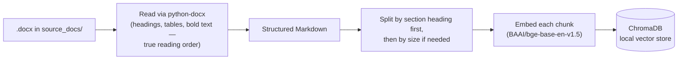
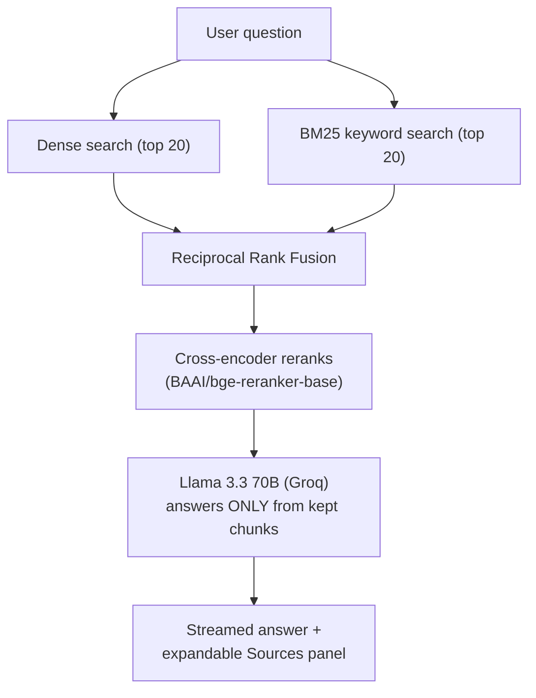

<div align="center">


# PhotonX Copilot

**Ask anything about PhotonX — answered straight from the source, never from a guess.**

A Retrieval-Augmented Generation (RAG) chatbot that answers questions using
*only* PhotonX's own company documents — with per-question source
citations you can actually inspect.

[](https://photonxrag.streamlit.app/)
[](https://www.python.org/)
[](https://streamlit.io/)
[](https://groq.com/)

[**🚀 Try it live**](https://photonxrag.streamlit.app/) · [How it works](#-how-it-works) · [Setup](#-getting-started) · [Tech stack](#-tech-stack--why)

</div>

---

## 📌 Overview

PhotonX Copilot is a **grounded** Q&A assistant — it never answers from the
model's general knowledge. Every response is built exclusively from
relevant passages retrieved from PhotonX's internal `.docx` documentation,
and every answer comes with an inspectable **"Sources"** panel showing the
exact excerpts it was built from.

No fixed source count, no guessed thresholds — the number of sources shown
adapts per question, based on how much of the document is genuinely
relevant to what was asked.

---

## ✨ Features

- 🔍 **Hybrid search** — combines meaning-based (dense) search with
  keyword (BM25) search, so both paraphrased and exact-term questions work
- 🎯 **Cross-encoder reranking** — a dedicated relevance model double-checks
  every candidate before it's allowed into the answer
- 📎 **Honest, dynamic citations** — shows *only* genuinely relevant
  sources (1 for a narrow question, several for a broad one), each
  expandable to the real excerpt it came from
- ⚡ **Streamed responses** — answers appear token-by-token via Groq's
  Llama 3.3 70B
- 📄 **Structure-aware document ingestion** — reads `.docx` headings,
  tables, and formatting in true reading order, not a flat text dump
- 🔄 **Incremental indexing** — only re-embeds documents that actually
  changed since the last run

---

## 🧠 How It Works

### Phase 1 — Ingestion *(run once, whenever the source document changes)*



### Phase 2 — Answering *(runs on every question)*



The relevance filter is the detail worth knowing: instead of always
showing a fixed number of sources, it looks at *this question's own*
ranked score list and cuts where there's a genuine drop-off in relevance —
so a narrow question can return one clean source, and a broad one can
return several, without ever needing a hand-tuned magic number.

---

## 🛠 Tech Stack — & Why

| Layer | Tool | Why this one |
|---|---|---|
| UI | **Streamlit** | Full chat interface in pure Python — no separate frontend to maintain |
| Document parsing | **python-docx** | Preserves real document structure (headings, tables, bold text) instead of a flat text dump |
| Chunking | **LangChain text splitters** | Splits by heading first to keep related content together, falls back to size-based splitting only when needed |
| Vector store | **ChromaDB** | Local, persistent, zero external infra |
| Dense embeddings | **BAAI/bge-base-en-v1.5** | Strong open-source semantic search model |
| Keyword search | **BM25** (`rank_bm25`) | Catches exact terms/names dense search alone can miss |
| Result fusion | **Reciprocal Rank Fusion** | Merges two ranked lists fairly without comparing incompatible raw scores |
| Reranking | **BAAI/bge-reranker-base** | Reads query + chunk *together* — far more accurate relevance judgment than search alone |
| Answer generation | **Llama 3.3 70B via Groq** | Fast, free-tier-friendly, streamable |

---

## 📂 Project Structure

```
PhotonXRAG/
├── app.py              # Streamlit UI — chat, styling, source display, per-answer scores
├── ingest.py            # Document ingestion pipeline (run when source docs change)
├── rag_engine.py         # Retrieval, fusion, reranking, relevance filtering, LLM calls
├── llm_metrics.py        # RAGAS-style scoring — one judge-LLM call, no extra deps
├── evaluate.py           # Corpus-level evaluation runner → writes eval_summary.json
├── eval_dataset.json     # Benchmark questions + known-correct reference answers
├── requirements.txt
├── assets/
│   └── photonx-logo.png
├── source_docs/
│   └── source_docs.docx  # Drop your .docx files here to index them
└── chroma_db/            # Generated — persisted vector index (not committed)
```

---

## 🚀 Getting Started

### 1. Clone & install

```bash
git clone https://github.com/<your-username>/PhotonXRAG.git
cd PhotonXRAG
pip install -r requirements.txt
```

### 2. Set your Groq API key

```bash
export GROQ_API_KEY=your_key_here
```

Or add it to `.streamlit/secrets.toml`:

```toml
GROQ_API_KEY = "your_key_here"
```

### 3. Add your source document(s)

Drop any `.docx` file into `source_docs/`, then build the index:

```bash
python ingest.py
```

Re-run this any time a source document changes — it only re-processes
files that actually changed.

### 4. Run the app

```bash
streamlit run app.py
```

---

## 📊 Measuring Quality

Two layers, answering two different questions.

### Per answer — "should I trust *this* reply?"

Every reply in the chat carries its own scores, computed by one judge-LLM call
in `llm_metrics.py` after the answer streams in. Six metrics as chips, with the
judge's stated reasoning behind an expander. Toggle it off in the sidebar if
Groq starts rate-limiting.

No reference answer exists for a live question, so **Context Recall**,
**Context Entity Recall** and **Answer Correctness** are the judge's estimate:
the first two against what a complete answer would need, the last against a
reference the judge drafts itself from the retrieved context — directional,
not the textbook metric. The other three are reference-free by definition and
measured as specified.

### Whole system — "how good is this RAG pipeline?"

Both paths run the **same** code over the same questions and produce the same
report card. Pick whichever suits you.

**From the deployed app** — expand **"How good is this RAG system overall?"** at
the bottom of the page, set how many questions, press **Run evaluation**. It
answers and scores each question inside the deployment, logging progress as it
goes, then renders the report card. Roughly 20–40s per question.

Results live in your browser session only, and are gone on reboot or for the
next visitor. To make them the default everyone sees, use the
**Download eval_summary.json** button under the report card and commit that file.

**From the command line** — writes `eval_summary.json` directly, so it becomes
the committed baseline:

```bash
python evaluate.py                   # full run → writes eval_summary.json
python evaluate.py --limit 3         # smoke test
python evaluate.py --sleep 3         # pause between questions (rate limits)
python evaluate.py --no-write        # print only
```

Either way it drives the **real** pipeline over every question in
`eval_dataset.json` and scores each answer against its known-correct reference.
Where the run happens does not change what is measured: the same
`rag_engine.py`, the same committed `chroma_db/`, the same models, the same Groq
API. `eval_summary.json` is just data.

Having a reference buys three things the live path cannot have:

| | Per answer | Whole system |
|---|---|---|
| Faithfulness, Answer Relevancy, Context Precision | ✅ | ✅ |
| Context Recall, Context Entity Recall | estimated | **measured vs reference** |
| Answer Correctness | estimated (vs. a judge-drafted reference) | **measured vs human reference** |
| Comparable across runs | ✗ | ✅ |

That last row is the real point: rerun the same set after changing chunking,
reranking or the prompt, and the numbers are a diff rather than an anecdote.

**Extending the set** — add objects to `questions` in `eval_dataset.json`. Only
`question` and `reference` are required. Keep references factual and terse:
they are compared claim by claim, so editorialising invents claims the answer
gets penalised for missing.

The `out-of-scope` row is the most important one in the file. Retrieval always
returns *something*, so that question measures whether the system declines
instead of answering from the model's own knowledge — Answer Correctness scores
`0.0` if it confidently answers anyway.

**On cost** — each question is one retrieval pass, one answer call and one judge
call. A full 9-question run is ~27 Groq requests and several minutes. On a free
tier that can trip the per-minute limit; raise the pause between questions (the
sidebar input, or `--sleep`) if you see rate-limit errors. Questions that fail
are reported individually and excluded from the averages rather than counted as
zero, so one rate-limited question does not read as a regression.

---

## 🌐 Live Demo

**[photonxrag.streamlit.app →](https://photonxrag.streamlit.app/)**

---

## 🗺 Roadmap Ideas

- [ ] Support multiple source documents with per-document filtering
- [ ] Conversation export
- [ ] Configurable relevance sensitivity from the UI

---

## 📄 License

Add your preferred license (e.g. MIT) as a `LICENSE` file in the repo root.

---

<div align="center">

Built with Streamlit, ChromaDB, and Groq.

</div>
